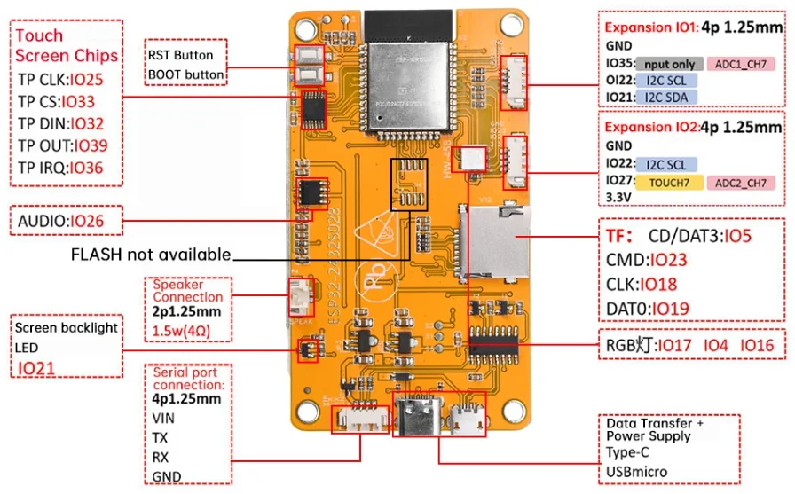
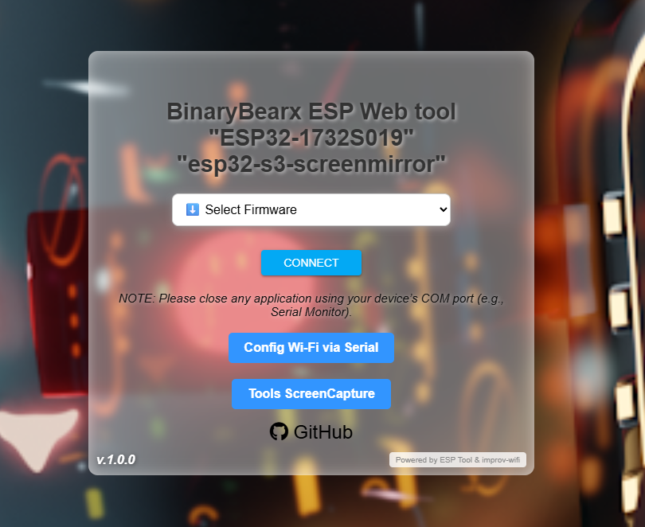
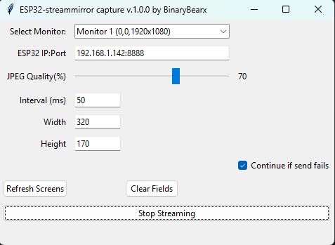
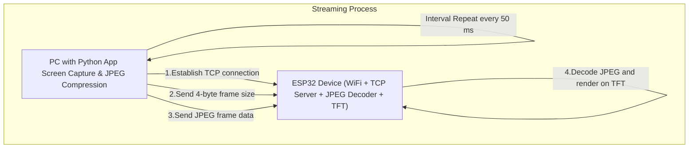

# This my hobby make some thing cool this web for flash firmware my project
# Firmware support for board ( 2 model )
# ⚡Model
# 1. ESP32-1732S019 (320x170) 1.9inch.
# Cheap Yellow Display (CYD) ESP32 Development Boards

# 2. ESP32-2432S028R (320x240) 1.9inch.
# Cheap Yellow Display (CYD) ESP32 Development Boards

## 🔨 Upload firmware [ESP-Tool Click Here!!👈🏻](https://binarybearzz.github.io/esp-tool-s3screenmirror/)

## ⬇️ Download [ScreenCaptureTool(Build exe)👇🏻](https://raw.githubusercontent.com/BinaryBearzz/esp-tool-s3screenmirror/refs/heads/main/tools/esp32-streammirrorcapture-continue.exe)

## 📄 Source code [ScreenCaptureTool👈🏻](https://github.com/BinaryBearzz/esp-tool-s3screenmirror/tree/main/tools/esp32-streammirrorcapture-continue.py)
 

- This web flasher is powered by [ESP Web Tools](https://github.com/esphome/esp-web-tools), a project by the [ESPHome](https://github.com/esphome) team.

- ESP Web Tools uses [esptool.js](https://github.com/esphome/esp-web-tools/tree/main/esptool-js) under the hood to flash firmware directly from your browser to ESP32 and ESP8266 devices.

- [Improve-WiFi](https://www.improv-wifi.com/serial) config WiFi via Serial.

## Authors

- [@BinaryBearx](https://github.com/BinaryBearzz)
